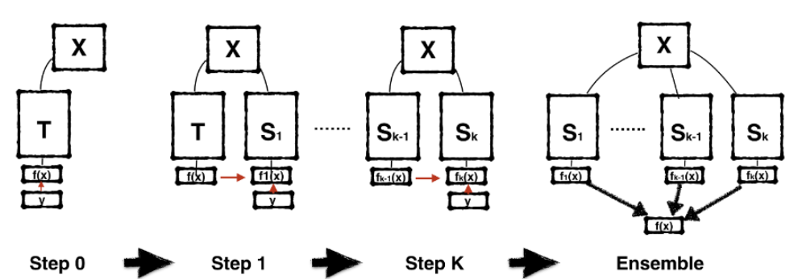

### **🔁 BORN-AGAIN NEURAL NETWORKS (BANs) FROM SCRATCH.**

Traditionally, information has been transferred between teacher and student models via a process known as **Knowledge Distillation** (KD). The goal of KD is simple - to train an initial teacher model, and then train a smaller student model in effort to achieve equivalent performances in a smaller parameter space. This student model can be trained in three main ways. The simplest and most common of these is known as **response-based distillation**, where the **distillation loss** is calculated simply by measuring the Euclidean distance between the student and teacher predictions. But, this of course is no guarantee that the student is learning the same underlying relationship as the teacher - **Feature-Based distillation** aims to solve this problem by attempting to match the **feature activations at the end of each layer** (attempting to coerce the student to learn similar feature maps to the teacher). More advanced and accurate still is **Relation-Based distillation** - rather than attempting to match the outputs of some layer or model, RKD aims to transfer **structural knowledge** regarding the relationship of different nodes (for example, calculating the angle formed by three given nodes or the distance between them). In any case, the **objective of such methods has always been to DISTILL information into a smaller form.**

This begs the question - if **smaller student models can achieve equivalent accuracies, can student models of equivalent size obtain HIGHER accuracies than their teachers?** This is, fundamentally, a Born-Again Neural Network (BAN) - a student model identically parametrized to its teacher, an effort that *surprisingly leads to the students (drastically) outperforming their respective teacher models.* This project will be replicating the original BAN paper (found at https://arxiv.org/pdf/1805.04770.pdf).

The purpose of this project/mini-experiment is to 1️⃣ **determine whether Dark Knowledge-based relationships (as we'll discuss further) are instrumental in how networks learn and generate predictions**, 2️⃣ understand from first-principles the theoretical nature of BAN distillation losses (Confidence Weighting by Teacher Max and Dark Knowledge with Permuted Predictions) and their practical nature via **implementing them from scratch in PyTorch**, 3️⃣ further uncover why **BANs tend to achieve higher overall accuracies when compared to teachers** (i.e. "re-learning" identical relationships but in more "effective" terms), and 4️⃣ **test the Dark Knowledge and BAN accuracy hypothesis via training an ensemble of 5 WideResNet 28-1 student models against a DenseNet 121 teacher**.

Let's get into it!

### 🤔 **The Math Behind BANs - Confidence Weighting, Dark Knowledge, and More.**

For a typical BAN system, the training procedure looks something like this (where $x$ is the input data, $T$ represents the initial teacher model, $S_k$ represents the $i-th$ student learner, $f(x)$ represents the classifier learned by the model, and $y$ represents the generated predictions):

</img>

In essence, each student learns from the student that came before it - student $S_k$ learns from student $S_{k-1}), and student $S_k$ learns from the initial teacher $T$. Once this ensemble has been trained, there are two options: one can either simply take the final student model, or one can "batch" the student models together into **a model ensemble**, where for a given input, the predictions of each model within the ensemble are averaged (or combined in some other way) to generate the final prediction. Generally speaking, model ensembles are prone to **higher accuracies** as they cover a larger proportion of hypothesis space, and thus can fit a wider set of distributions. 

#### **👆 What's the point of BANs?**

Fundamentally, the idea of the BAN is that **the teacher model's activations and end prediction distribution (i.e. the probability distribution of whatever predictions have been generated) contain critical information in ADDITION to the training set that can result in better predictions.** Analogically, it is much like a student learning not only the required material, but additional information beyond said material that may drastically boost their academic performance. Mathematically, this operates on the principle that **minimizing the LOSS FUNCTION of a given task is not necessarily the same as minimizing generalization error.**

While a teacher model may have drastically minimized the loss function, this does not meant that it is proficient in the given task; or that the classifier it has learned in hypothesis space is adept enough to fit most possible distribution. But, it is also possible that **in the process of optimizing the loss function, the teacher model stumbled upon some critical insights that can serve to be instrumental in improving model generalization.**

So, if we were to learn **from both the training set AND the teacher**, we increase the amount of potentially relevant available information - the student can now use the teacher's predictions and learned patterns as a starting point, potentially learning more advanced and accurate classifiers.

#### **🪄Dark Knowledge - and why it matters.**

Let's say that a certain model is trying to classify a dog, train, car, and cat. Let's say that we want to test the model on the picture of a dog. When we pass in this image and apply the SoftMax activation, we'll get something like this:

*Quick refresher - the SoftMax activation takes a set of input values, and changes them into probabilities between 0 and 1. For a given vector $z_i$, $\sigma$ (SoftMax) $z_i$ is given by:*

$$ \sigma(z_i) = \frac{e^{z_{i}}}{\sum_{j=1}^K e^{z_{j}}} \ \ \ for\ i=1,2,\dots,K $$

*In other words - for each logit, it is simply $E^{prob}$ divided by the SUM of $e$ raised to all of the other probabilities. This function will be important later!*

|  Dog  |  Car  | Train |  Cat  |
|-------|-------|-------|-------|
|0.9    | 0.002 | 0.001 |0.0897 |

Now, if we were trying to extract a prediction from the model, the end answer is simple - the model obviously predicted dog (with the highest probability at 90%). We might even try to use this information for KD - simply checking if **both the teacher and student model predicted dog as their end prediction.**

But, **there's a huge problem with this approach - it ignores the probabilities of the remainder of the labels. More accurately, it ignores the fact that the model stated that the given image was more likely to be a cat than a car, and more likely to be a car than a train.** This might be hard to tell because the numbers are so small - so, let's introduce something known as **temperature** in the above SoftMax formula so that we can see those other predictions better **without affecting the order of the predictions.**

It's pretty simple - all we need to do is **divide the probability by some temperature constant $T$ to rescale the values.** The HIGHER the temperature, the **"softer" the distribution**, and the LOWER the temperature, the "sharper" (more drastic differences between labels) the distribution (generally speaking). Here's SoftMax with temperature:

$$ \sigma(z_i) = \frac{e^{\frac{z_{i}}{T}}}{\sum_{j=1}^K e^{\frac{z_{j}}{T}}} \ \ \ for\ i=1,2,\dots,K $$

Now, if we apply an arbitrarily high temperature to our previous distribution: (*these values are just for demonstration purposes and NOT REAL!*)

|  Dog  |  Car  | Train |  Cat  |
|-------|-------|-------|-------|
|0.4    | 0.09  | 0.04  |0.27   |

In percentages for clarity:

|  Dog  |  Car  | Train |  Cat  |
|-------|-------|-------|-------|
| 40%   | 9%    | 4%    | 27%   |

Now, we can **clearly see that the model believes that the image is more likely to be a cat than a car** - this indicates that the model **has learned a relationship: that animals are different from objects.** Other ANIMALS are more likely to be confused with other animals, whereas an animal is drastically less likely to be confused with an object like a car. 

#### **This is dark knowledge - hidden relationships the model has learned that can be critical in completing the task at hand that can be found in its underlying probability distribution** learning that animals $\ne$ things is a critical first step in distinguishing the classes.

If this Dark Knowledge (DK) hypothesis holds true, then **it makes sense that transferring this DK between teachers and students should be critical in KD and in training BANs.** But, **is it really dark knowledge information transfer that makes knowledge distillation successful?**

Let's explore this further.

#### 📚 **Is Dark Knowledge Truly Important? Confidence Weighting.**

Remember how I said that the SoftMax function would be useful? Now's the time to use it.

First, let's understand **cross entropy loss.** The SoftMax function is an **activation - it normalizes our logits, but does NOT tell us the loss.** This is where cross entropy comes in - it compares two SoftMax-activated distributions and **returns the error between the two.** The underlying logic is simple -> simply multiply **the true probability distribution** by the log (usually natural log) of the given distribution **for each value** (i.e. compare the dog values, then the car, train, and cat, etc.) and simply sum them up!

$$ \ell(p, q) = -\sum_{∀x}p(x)log(q(x)) $$ 
...where $p(x)$ is the true distribution and $q(x)$ is the predicted distribution.

When we perform gradient descent, we must compute the **gradient or partial derivative** of this function with respect to the $i_{th}$ parameter $z_i$ - in other words, we must compute the value of $ \frac{∂ \ell}{∂ z_i} $. Here's the cool part: **the partial derivative of the cross entropy loss function is just the current distribution minus the true distribution!** And, if we **expand both $q_i$ and $p_i$ to reveal how they were calculated** (remember that the SoftMax activation was applied first to obtain both $q_i$ and $p_i$ - we are simply expressing those two variables in terms of the SoftMax calculation), we get:

$$ \frac{∂l_i}{∂z_i}=q_i-p_i=\frac{e^{z_i}}{Σ_{j=1}^ne^{z_j}}-\frac{e^{t_i}}{Σ_{j=1}^ne^{t_j}} $$

Remember that, for any given student model, the true distribution for it would be the teacher's distribution (not the distribution of the actual dataset labels). So here, $p_i$ serves as the **teacher's prediction distribution** whereas $q_i$ **serves as the student's prediction distribution.**

Let's suppose for a second, that instead of the $i_{th}$ element of the predictions, we are on the TRUE predicted element (represented by $*$). In the context of the previous example, this would mean that we were currently on the "Dog" class, the class/element with the highest probability. Now, let's suppose **that the teacher is EXACTLY accurate for this example - that is, instead of outputting 0.9 or 0.5 for this class, it outputted a perfect 1.0.** In this case, the distribution would look something like this:

|  Dog  |  Car  | Train |  Cat  |
|-------|-------|-------|-------|
| 1.0   | 0.0   | 0.0   | 0.0   |

Let's now draw our attention back to $p_i$, which is the SoftMax of the given element. Since we are on the highest element (the "true" prediction) and it perfectly matches the "target" distribution (the distribution of the actual dataset - **remember that the dataset, after being one-hot encoded, just has 1 for the true class and 0 for everything else**), then this term **will simply yield 1**!

So, the **partial derivative when the teacher's true prediction exactly matches the target distribution (and when we are iterating over that true prediction $*$)** is:

$$ \frac{∂l_i}{∂z_i}=q_i-p_i=\frac{e^{z_i}}{Σ_{j=1}^ne^{z_j}}-1.0 $$

Now that we know the partial derivative of the loss function iterating over one sample, let's consider what would happen if we were to iterate across not only the $i_th$ sample, but an entire batch of size $b$. Since we want to find the **average loss** for the entire batch, we can divide the sum of the loss function applied to $x_1, t_1...x_b, t_b$ (where $x_n$ is the prediction and $t_n$ is the true label) by the batch size. **So, the loss of an entire minibatch is given by:**

$$ \ell(x_1,t_1..x_b,t_b)=\frac{1}{b}\sum^{b}_{s=1}\ell(x_s,t_s) $$

So, if we wanted to find the gradient of this loss over the batch, we would simply find the average gradient across all the PREDICTED samples, right (the predicted sample being the highest probability)? In other words, we would take $q_*-p_*$ for each sample in the minibatch and then average it. This yields:

$$ \frac{1}{b}\sum^b_{s=1}\frac{∂L_{i,s}}{∂z_{i,s}}=\frac{1}{b}\sum^{b}_{s=1}(q_{*,s}-p_{*,s}) $$

But, this is missing some key information - namely, **the Dark Knowledge hidden inside the remainder of the probability distribution.** We are computing the gradients over **the true predictions, but NOT the gradients for each probability inside each sample.** We can fix this by adding another term - a **Dark Knowledge Term** - that, **for each sample, iterates over *all logits* rather than just the predicted (max) ones and calculates *their difference from the teacher logits.***

$$ \frac{1}{b}\sum^b_{s=1}\sum^n_{i=1}\frac{∂L_{i,s}}{∂z_{i,s}}=\frac{1}{b}\sum^{b}_{s=1}(q_{*,s}-p_{*,s})+\frac{1}{b}\sum^b_{s=1}\sum^{n-1}_{i=1}(q_{i,s}-p_{i,s}) $$

Remember - usually, we would **just consider the first term** (the difference between the predictions for the correct classes). But, if the Dark Knowledge Hypothesis is correct, then the remainder of the probability distribution matters as well. So, we must **also consider these differences for each individual logit as well.**

Let's consider something - we know that the **ground truth prediction for the correct class in the dataset will always be 1.** A given dataset will be one-hot-encoded, or simply have the index of the correct class, but in either case if we were to compute the probabilities they would be (0, 0, 0, 1), where 1 is the probability of the correct class. The probability for the correct class will always be 1 - if $y$ represents the ground truth and $*$ represents the probability at the true class, then $y_{*,s}$ will always be one, and will be zero whenever it is not on the true class. **what happens if we combine this term $y_{*,s}$ with $p_{*,s}$**? 